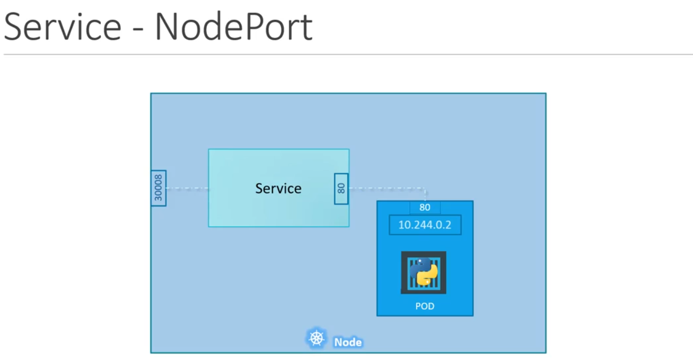

# CKA

#### Nodes(Minions)
Containers will be launched in a node. What if the node on which our applications are running fails. Our application goes down as well. So you need to have more than 1 node.

#### Cluster
A cluster is a set of nodes grouped together. This way even if one node fails you have your application accessible from the other nodes. Helps to share load as well. Master watches over the nodes in the cluster and is responsible for the actual orchestration of containers on the worker nodes.

#### Master vs Worker Nodes

##### Master
Contains
- kube-apiserver: Acts as the frontend for kubernetes, talks to the api server to interact with the cluster
- etcd: Distributed key-value store to store all data used to manage the cluster
- controller: Noticing and responding when nodes, containers or endpoints goes down
- scheduler: Distributing work or containers across multiple nodes

##### Worker
Contains
- kubelet: Is the agent responsible for making sure that the containers are running on the node as expected
- container runtime: Underline software used to run containers

#### Pods
Kubernetes does not deploy containers directly on the worker nodes, the containers are encapsulated into a kubernetes object known as a Pod. The containers inside a pod will have access to the same storage, the same network namespace and same fate(created together, destroyed together)

- A pod should have mandatory apiVersion, kind, metadata and spec 
- Metadata is a dictionary and it should have name and labels under it(what kubernetes expect)
- Labels is also a dictionary and you can have many key value pairs for it
- Spec is a dictionary and you can place multiple containers inside the container(List/Array element) tag
```yaml
apiVersion: v1
kind: Pod
metadata:
  name: myapp-pod
  labels:
    app: myapp
    type: front-end
spec:
  containers:
  - name: nginx-container
    image: nginx
    ports:
    - containerPort: 80
```

```cmd
kubectl apply -f pod-definition.yml
kubectl get pods
kubectl describe pods myapp-pod
```

#### Replication Controller
Ensures that the specified number of pods are running at all times. To create multiple pods to share the load across them. When the number of users increase we deploy additional pods to balance the load across the pods. If the demand further increases and if we were to run out of resources on the first node we could deploy additional pods across the other nodes in the cluster.

```yml
apiVersion: v1
kind: ReplicationController
metadata: 
  name: myapp-rc
  labels: 
    app: myapp
    type: front-end
spec: 
  template:
    metadata:
      name: myapp-pod
      labels:
        app: myapp
        type: front-end
    spec:
      containers:
        - name: nginx-container
          image: nginx
  replicas: 3
```

```cmd
kubectl apply -f rc-definition.yml
kubectl get replicationcontroller
kubectl get pods
kubectl delete replicationcontroller myapp-rc
```

#### ReplicaSet
- It is mandatory to have a selector tag under spec if using ReplicaSet. This is the difference between ReplicationController and ReplicaSet. If you have created pods before creating the ReplicaSet, you can use the selector to identify those pods, or else you can add the pod-definition inside the template
```yml
apiVersion: apps/v1
kind: ReplicaSet
metadata: 
  name: myapp-replicatset
  labels: 
    app: myapp
    type: front-end
spec: 
  template:
    metadata:
      name: myapp-pod
      labels:
        app: myapp
        type: front-end
    spec:
      containers:
        - name: nginx-container
          image: nginx
  replicas: 3
  selector:
    matchLabels:
      type: front-end
```

```cmd
kubectl apply -f replicaset-definition.yml
kubectl get replicaset
kubectl get pods
kubectl delete replicaset myapp-replicatset
kubectl describe replicaset
kubectl delete pod $pod_name
```

#### Labels and Selectors
We can use the labels as a filter to selector. This way replicaset will know which pods to monitor.
```yml
metadata: 
  name: myapp-pod
  labels: 
    tier: front-end
```

```yml
selector:
  matchLabels:
    tier: front-end
```

#### Scaling
```cmd
kubectl replace -f replicatset-definition.yml
kubectl scale --replicas=6 -f replicatset-definition.yml
```

#### Deployments

```yml
apiVersion: apps/v1
kind: Deployment
metadata: 
  name: myapp-deployment
  labels: 
    app: myapp
    type: front-end
spec: 
  template:
    metadata:
      name: myapp-pod
      labels:
        app: myapp
        type: front-end
    spec:
      containers:
        - name: nginx-container
          image: nginx
  replicas: 3
  selector:
    matchLabels:
      type: front-end
```

```cmd
kubectl create -f deployment-definition.yml
kubectl get deployments
kubectl get replicasets
kubectl get pods
kubectl describe deployment
```

#### Updates and Rollbacks
When you first create a deployment it triggers a rollout. A new rollout creates a new deployment revision. In the future when the application is upgraded, a new rollout is triggered and a new deployment revision is created.

```cmd
kubectl rollout status deployment/myapp-deployment
kubectl rollout history deployment/myapp-deployment
kubectl apply -f deployment-definition.yml
kubectl setimage deployment/myapp-deployment nginx=nginx:1.9.1
kubectl describe deployment myapp-deployment
kubectl rollout undo deployment/myapp-deployment
kubectl run nginx --image=nginx
kubectl get deployments
kubectl create -f deployment-definition.yml --record
```

- Deployment Strategies
  1. Recreate: Destroy all the old versions and create the new versions. There will be an application downtime
  2. Rolling update(default): Incremently bring down old version/create new version at a time. In this way application never goes down


#### Networks
IP address is assigned to a pod. All nodes can communicate with all containers and vice versa without using a NAT. Internal pod network is in the range of 10.244.0.0

#### Services
Kubernetes services enable communication between various components within and outside of the application.

#### NodePort
Service makes an internal pod accessible on a port on the pod



There are 3 ports involved
  - Target Port(80): The port on the pod where the actual web server is runnning
  - Port(80): The port on the service
  - NodePort(30008): The node port(30000-32767)

```yaml
apiVersion: v1
kind: Service
metadata: 
  name: myapp-nodeport-service
spec: 
  type: NodePort
  ports:
    - targetPort: 80
      port: 80
      nodePort: 30008
  selector:
    app: myapp
    type: front-end
```
- 'port' is the only mandatory field and ports is an array

```cmd
kubectl create -f nodeport-service-definition.yml
kubectl get services
```

In any case whether its a single pod in a single node, multiple pods in a single node, multiple pods in multiple nodes the service is created exactly same. When pods are removed or added the service is automatically updated.

- Get the ip using `ipconfig` and use `curl $ipconfg:30008`
#### ClusterIP
Service creates a virtual IP inside the cluster to enable communication between differnet services

```yml
apiVersion: v1
kind: Service
metadata: 
  name: myapp-clusterip-service
spec: 
  type: ClusterIP
  ports:
    - targetPort: 80
      port: 80
  selector:
    app: myapp
```

Service can be accessed by other pods using cluster ip or the service name

#### LoadBalancer
Provisions a load balancer for our application

#### Microservices

```cmd
docker run -d --name=redis redis
docker run -d --name=db -e POSTGRES_PASSWORD=123 postgres:16
docker run -d --name=vote -p 5000:80 saiachyuthm/voting-app
docker run -d --name=result -p 5001:80 saiachyuthm/result-app
docker run -d --name=worker saiachyuthm/worker-app
```

#### Kubectl commands
```cmd
- Run an applicatio
kubectl run hello-minikube

- Get Cluster information
kubectl cluster-info

- List all the nodes part of the cluster
kubectl get nodes

- Run a nginx pod
kubectl run nginx --image nginx

- Check created pod
kubectl describe pods nginx
```