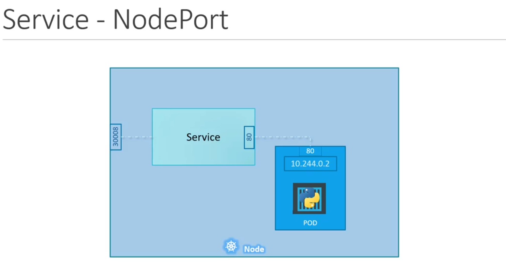
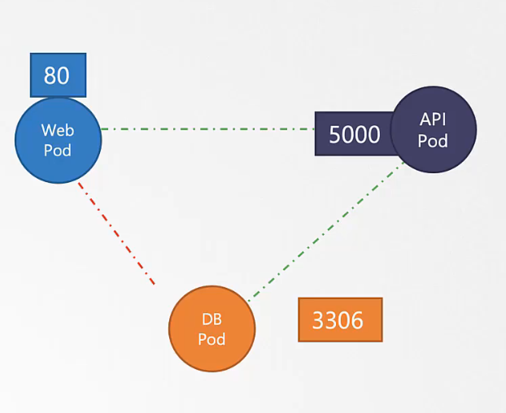
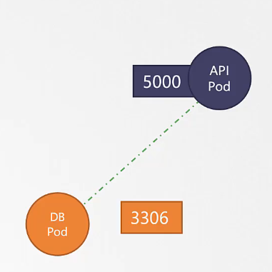

# CKA

#### Nodes(Minions)
Containers will be launched in a node. What if the node on which our applications are running fails. Our application goes down as well. So you need to have more than 1 node.

#### Cluster
A cluster is a set of nodes grouped together. This way even if one node fails you have your application accessible from the other nodes. Helps to share load as well. Master watches over the nodes in the cluster and is responsible for the actual orchestration of containers on the worker nodes.

#### Master vs Worker Nodes

#### Master
Contains
- kube-apiserver: Acts as the frontend for kubernetes, talks to the api server to interact with the cluster
- etcd: Distributed key-value store to store all data used to manage the cluster
- controller: Notices and responds when nodes, containers or endpoints goes down
- scheduler: Distributing work or containers across multiple nodes, looks for newly created containers and assigns them to nodes

#### Worker
Contains
- kubelet: Is the agent responsible for making sure that the containers are running on the node as expected
- container runtime: Underline software used to run containers

```cmd
kubectl run hello-minikube
kubectl cluster-info
kubectl get nodes
```

#### Pods
Kubernetes does not deploy containers directly on the worker nodes, the containers are encapsulated into a kubernetes object known as a Pod. The containers inside a pod will have access to the same storage, the same network namespace and same fate(created together, destroyed together)

- A pod have a one to one relationship with the containers
- A pod should have mandatory apiVersion, kind, metadata and spec 
- Metadata is a dictionary and it should have name and labels under it(what kubernetes expect)
- Labels is also a dictionary and you can have many key value pairs for it
- Spec is a dictionary and you can place multiple containers inside the container(List/Array element) tag

```yaml
apiVersion: v1
kind: Pod
metadata:
  name: myapp-pod
  labels:
    app: myapp
    type: front-end
spec:
  containers:
  - name: nginx-container
    image: nginx
    ports:
    - containerPort: 80
```

```cmd
kubectl apply -f pod-definition.yml
kubectl get pods
kubectl describe pod myapp-pod
```

#### Questions - Pods
```cmd
- Check running pods
kubectl get pods

- Create a new pod with the nginx image
kubectl run nginx --image=nginx

- How many pods in default namespace?
kubectl get pods --namespace default

- What is the image used to create the new pods?
kubectl describe pod newpods-92tl5

- Which nodes are these pods placed on?
kubectl get pods -o wide

- What images are used in the new webapp pod?
kubectl describe pod webapp
And get how many containers are present

- What does the READY column in the output of the kubectl get pods command indicate?
Running container count/ Total container count

- Delete the webapp Pod
kubectl delete pod webapp

- Create a new pod with the name redis and the image redis123?
kubectl run redis --image=redis123 --dry-run=client -o=yaml > redis.yaml
kubectl apply -f redis.yaml

- Create a pod definition file from a pod?
kubectl get pod <pod-name> -o yaml > pod-definition.yaml
```

#### Replication Controller
Ensures that the specified number of pods are running at all times. To create multiple pods to share the load across them. When the number of users increase we deploy additional pods to balance the load across the pods. If the demand further increases and if we were to run out of resources on the first node we could deploy additional pods across the other nodes in the cluster.

```yml
apiVersion: v1
kind: ReplicationController
metadata: 
  name: myapp-rc
  labels: 
    app: myapp
    type: front-end
spec: 
  template:
    metadata:
      name: myapp-pod
      labels:
        app: myapp
        type: front-end
    spec:
      containers:
        - name: nginx-container
          image: nginx
  replicas: 3
```

```cmd
kubectl apply -f rc-definition.yml
kubectl get replicationcontroller
kubectl get pods
kubectl delete replicationcontroller myapp-rc
```

#### ReplicaSet
- It is mandatory to have a selector tag under spec if using ReplicaSet. This is the difference between ReplicationController and ReplicaSet. If you have created pods before creating the ReplicaSet, you can use the selector to identify those pods, or else you can add the pod-definition inside the template
```yml
apiVersion: apps/v1
kind: ReplicaSet
metadata: 
  name: myapp-replicatset
  labels: 
    app: myapp
    type: front-end
spec: 
  template:
    metadata:
      name: myapp-pod
      labels:
        app: myapp
        type: front-end
    spec:
      containers:
        - name: nginx-container
          image: nginx
  replicas: 3
  selector:
    matchLabels:
      type: front-end
```

```cmd
kubectl apply -f replicaset-definition.yml
kubectl get replicaset
kubectl get pods
kubectl delete replicaset myapp-replicatset
kubectl describe replicaset
kubectl delete pod $pod_name

- How to update the defintion.yaml file?
kubectl replace -f definition.yaml
kubectl scale --replicas=6 -f definition.yaml
kubectl scale --replicas=6 <TYPE> <NAME>
```

#### Questions - ReplicaSet
```cmd
- How many ReplicaSets exist on the system?
kubectl get replicasets

- What is the image used to create the pods in the new-replica-set?
kubectl describe replicaset new-replica-set

- Delete any one of the 4 PODs?
kubectl delete pod new-replica-set-55nxs

- Delete the two newly created ReplicaSets - replicaset-1 and replicaset-2?
kubectl delete rs replicaset-1 replicaset-2

- Scale the ReplicaSet to 5 PODs?
kubectl scale --replicas=5 rs new-replica-set

- Now scale the ReplicaSet down to 2 PODs?
kubectl edit rs new-replica-set 
```

#### Labels and Selectors
We can use the labels as a filter to selector. This way replicaset will know which pods to monitor.
```yml
metadata: 
  name: myapp-pod
  labels: 
    tier: front-end
```

```yml
selector:
  matchLabels:
    tier: front-end
```

#### Scaling
```cmd
kubectl replace -f replicatset-definition.yml
kubectl scale --replicas=6 -f replicatset-definition.yml
```

#### Deployments

```yml
apiVersion: apps/v1
kind: Deployment
metadata: 
  name: myapp-deployment
  labels: 
    app: myapp
    type: front-end
spec: 
  template:
    metadata:
      name: myapp-pod
      labels:
        app: myapp
        type: front-end
    spec:
      containers:
        - name: nginx-container
          image: nginx
  replicas: 3
  selector:
    matchLabels:
      type: front-end
```

```cmd
kubectl create -f deployment-definition.yml
kubectl get deployments
kubectl get replicasets
kubectl get pods
kubectl describe deployment $deployment_name
kubectl get all
```

#### Questions - Deployment
```cmd
- How many deployments exists in the system?
kubectl get deployments

- What is the image used to create the pods in the new deployment?
kubectl describe deployment frontend-deployment

- Create a new Deployment with the below attributes using your own deployment definition file. Name: httpd-frontend; Replicas: 3; Image: httpd:2.4-alpine
kubectl create deployment httpd-frontend --replicas=3 --image=httpd:2.4-alpine
```

#### Namespaces
- Kubernetes creates default, kube-system and kube-public namespaces during startup, so that we wont accidently delete any resources
```text
db-service   . dev       . svc     . cluster.local
Service Name   Namespace   Service   Domain   
```

- Create a new namespace
```yaml
apiVersion: v1
kind: Namespace
metadata: 
  name: dev
```

```cmd
- Get pods in a different namespace
kubectl get pods --namespace=kube-system

- Create a namespace
kubectl create namespace <NAMESPACE_NAME>

- Set the namespace to 'dev' so that you dont need to specify this in each call
kubectl config set-context $(kubectl config current-context) --namespace=dev

- Get pods in all the namespaces
kubectl get pods --all-namespaces
```

- Create resource quota
```yaml
apiVersion: v1
kind: ResourceQuota
metadata: 
  name: compute-quota
  namespace: dev
spec:
  hard:
    pods: "10"
    requests.cpu: "4"
    requests.memory: 5Gi
    limits.cpu: "10"
    limits.memory: 10Gi
```

#### Questions - Namespaces
```cmd
- How many Namespaces exist on the system?
kubectl get ns

- How many pods exist in the research namespace?
kubectl get pods --namespace=research

- Create a POD in the finance namespace?
kubectl run redis --image=redis --namespace=finance

- Which namespace has the blue pod in it?
kubectl get pods --all-namespaces
kubectl get pods -A

- What DNS name should the Blue application use to access the database db-service in its own namespace?
Use the service name

- What DNS name should the Blue application use to access the database db-service in the dev namespace?
db-service.dev.svc.cluster.local
```

```yml
apiVersion: v1
kind: Pod
metadata: 
  name: myapp-pod
  namespace: dev
  labels: 
    app: myapp
    type: front-end
spec: 
  containers:
  - name: nginx-container
    image: nginx
```

#### Imperative Commands
```cmd
- Generate POD Manifest YAML file (-o yaml). Don't create it(--dry-run)
kubectl run nginx --image=nginx --dry-run=client -o yaml

- Create a deployment with 4 replicas
kubectl create deployment --image=nginx nginx --replicas=4

- Scale a deployment
kubectl scale deployment nginx --replicas=4

- Create a Service named redis-service of type ClusterIP to expose pod redis on port 6379
kubectl expose pod redis --port=6379 --name redis-service --dry-run=client -o yaml

- Create a Service named nginx of type NodePort to expose pod nginx's port 80 on port 30080 on the nodes
kubectl expose pod nginx --port=80 --name nginx-service --type=NodePort --dry-run=client -o yaml
```

#### Questions - Imperative Commands
```cmd
- Deploy a pod named nginx-pod using the nginx:alpine image?
kubectl run nginx-pod --image=nginx:alpine

- Deploy a redis pod using the redis:alpine image with the labels set to tier=db?
kubectl run redis --image=redis:alpine --labels tier=db

- Create a service redis-service to expose the redis application within the cluster on port 6379?
kubectl create service clusterip --tcp=6379:6379 redis-service

- Create a deployment named webapp using the image kodekloud/webapp-color with 3 replicas?
kubectl create deployment webapp --image=kodekloud/webapp-color --replicas=3

- Create a new pod called custom-nginx using the nginx image and run it on container port 8080?
kubectl run custom-nginx --image=nginx --port=8080

- Create a new namespace called dev-ns?
kubectl create ns dev-ns

- Create a new deployment called redis-deploy in the dev-ns namespace with the redis image. It should have 2 replicas?
kubectl create deployment redis-deploy --namespace=dev-ns --image=redis --replicas=2

- Create a pod called httpd using the image httpd:alpine in the default namespace. Next, create a service of type ClusterIP by the same name (httpd). The target port for the service should be 80?
kubectl run httpd --image=httpd:alpine --port=80 --expose=true
```

#### Commands and Arguments
- When you execute `docker run ubuntu` and execute `docker ps -a` you can see the container in an exited state. The container only lives as the process inside it is alive. Containers are not meant to host an operating system. Containers are meant to run a specific task or a process.

```cmd
- Container exists after creation
docker run ubuntu

- Container sleeps for 5 seconds and then exists
docker run ubuntu sleep 5
```
- You can use the ENTRYPOINT to pass an Argument to the docker compose file

```Dockerfile
FROM ubuntu
ENTRYPOINT ["sleep"]
```

```cmd
docker run ubuntu-sleeper 10
```

- If you dont specify any arguments in `docker run` command how to make sure to add a default value in the docker compose file itself

```Dockerfile
FROM ubuntu
ENTRYPOINT ["sleep"]
CMD ["5"]
```

- In Kubernetes world there are 2 fields that correspond to two instructions in the docker file
1. command field overrides ENTRYPOINT instruction
2. args field overrides CMD instruction

```yaml
apiVersion: v1
kind: Pod
metadata: 
  name: ubuntu-sleeper-pod
spec: 
  containers:
  - name: ubuntu-sleeper
    image: ubuntu-sleeper
    command: ["sleep2.0"]
    args: ["10"]
```

#### Commands and Arguments - Questions

```cmd
- What is the command used to run the pod ubuntu-sleeper?
kubectl describe pod ubuntu-sleeper

- Create a pod with given specification. Pod Name: webapp-green, Image: kodekloud/webapp-color, Command line arguments: --color=green
kubectl run webapp-green --image=kodekloud/webapp-color -- --color green
```

#### ENV Variables in K8s

```cmd
docker run -e APP_COLOR=pink simple-webapp-color
```

```yaml
apiVersion: v1
kind: Pod
metadata: 
  name: simple-webapp-color
spec: 
  containers:
  - name: simple-webapp-color
    image: simple-webapp-color
    ports:
      - containerPort: 8080
    env:
      - name: APP_COLOR
        value: pink
```

- ENV value types
  1. Plain key value
  ```yaml
  env:
    - name: APP_COLOR
      value: pink
  ```

  2. ConfigMaps
  ```yaml
  env:
    - name: APP_COLOR
      valueFrom:
        configMapKeyRef:
  ```

  3. Secrets
  ```yaml
  env:
    - name: APP_COLOR
      valueFrom:
        secretKeyRef:
  ```

#### ConfigMaps
We can take all the env specific data out of the pod definition file and manage it centrally using configuration maps (ConfigMaps). There are 2 phases involved in configuring ConfigMaps. 
  1. Create the ConfigMaps
  2. Inject the ConfigMaps to pod definition file


```cmd
- Create a config map in Imperative way from literal
kubectl create configmap <CONFIG_NAME> --from-literal=<KEY>=<VALUE>
kubectl create configmap app-config --from-literal=APP_COLOR=blue

- Create a config map in Imperative way from file
kubectl create configmap <CONFIG_NAME> --from-file=<PATH_TO_FILE>
kubectl create configmap app-config --from-file=app_config.properties

- View ConfigMaps
kubectl get cm

- Describe ConfigMaps
kubectl describe cm <CONFIG_MAP_NAME>
```

```yaml
apiVersion: v1
kind: ConfigMap
metadata: 
  name: app-config
data:
  APP_COLOR: blue
  APP_MODE: prod
```

```cmd
kubectl create -f config-map.yaml
```

- Injecting whole configmap to the pod
```yml
apiVersion: v1
kind: Pod
metadata: 
  name: ubuntu-sleeper-pod
spec: 
  containers:
  - name: ubuntu-sleeper
    image: ubuntu-sleeper
    envFrom:
    - configMapRef:
      name: app-config
```
- Injecting as a single key value
```yml
apiVersion: v1
kind: Pod
metadata: 
  name: ubuntu-sleeper-pod
spec: 
  containers:
  - name: ubuntu-sleeper
    image: ubuntu-sleeper
    env:
    - name: APP_COLOR
      valueFrom:
        configMapKeyRef:
          name: app-config
          key: APP_COLOR
```

#### Questions - ConfigMaps
```cmd
- What is the environment variable name set on the container in the pod?
kubectl describe pod webapp-color

- How many ConfigMaps exists in the default namespace?
kubectl get configmaps

- Identify the database host from the config map db-config?
kubectl describe configmap db-config

- Create a configmap?
kubectl create configmap webapp-config-map --from-literal=APP_COLOR=darkblue --from-literal=APP_OTHER=disregard
```

#### Secrets
The configMap stores configuration data in plain text. This is where secrets are more useful becasue they store sensitive information. Secrets are not encrypted, only encoded.
Anyone who create pods/deployments in the same namespace can access the secrets as well. So configure RBAC to secrets.

```cmd
- Create secrets in Imperative way from literal
kubectl create secret generic <SECRET_NAME> --from-literal=<KEY>=<VALUE>
kubectl create secret generic app-secret --from-literal=DB_HOST=mysql

- Create secrets in Imperative way from file
kubectl create secret generic <SECRET_NAME> --from-file=<PATH_TO_FILE>
kubectl create secret generic app-secret --from-file=app-secret.properties

- Converting plain data to encoded format
echo -n '<PLAIN_VALUE>' | base64
echo -n 'mysql' | base64

- Decoding to plain text
echo -n '<DECODED_VALUE>' | base64 --decode
echo -n 'gsgs=' | base64 --decode

- Describe the secrets
kubectl describe secrets
```

```yml
apiVersion: v1
kind: Secret
metadata: 
  name: app-secret
data:
  APP_COLOR: blue
  APP_MODE: prod
  DB_PASSWORD: gsgs=
```

```yml
apiVersion: v1
kind: Pod
metadata: 
  name: simple-secret-pod
  labels:
    name: simple-secret-pod
spec:
  containers:
  - name: simple-secret-pod
    image: simple-secret-pod
    ports:
      - containerPort: 8080
    envFrom:
    - secretRef:
        name: app-secret
```

```yml
apiVersion: v1
kind: Pod
metadata: 
  name: simple-secret-pod
  labels:
    name: simple-secret-pod
spec:
  containers:
  - name: simple-secret-pod
    image: simple-secret-pod
    ports:
      - containerPort: 8080
    env:
    - name: DB_PASSWORD
      valueFrom:
        secretKeyRef:
          name: app-secret
          key: DB_PASSWORD
```

#### Questions - Secrets
```cmd
- How many Secrets exist on the system?
kubectl get secrets

- How many secrets are defined in the dashboard-token secret?
kubectl get secret dashboard-token

- The reason the application is failed is because we have not created the secrets yet. Create a new secret named db-secret with the data given below. Name: db-secret; DB_Host=sql01; DB_User=root; DB_Password=password123
kubectl create secret generic db-secret --from-literal=DB_Host=sql01 --from-literal=DB_User=root --from-literal=DB_Password=password123
```

#### Encrypting secret data at REST
```cmd
- Create a secret object
kubectl create secret generic my-secret --from-literal=key1=supersecret

- Check the created secret
kubectl get secret my-secret -o yaml

- Anyone can decode and see the secret
echo -n 'c3VwZXJzZWNyZXQ=' | base64 --decode

- Install etcdctl
apt-get install etcd-client

- Still you can see the secret value in plain text in etcd, thats why we need to encrypt it
ETCDCTL_API=3 etcdctl --cacert=/etc/kubernetes/pki/etcd/ca.crt --cert=/etc/kubernetes/pki/etcd/server.crt --key=/etc/kubernetes/pki/etcd/server.key get /registry/secrets/default/my-secret | hexdump -C

- So we need to enable Encryption at REST to mitigate the problem. Navigate to kube-apiserver and check whether encryption at REST is enabled (make sure --encryption-provider-config is in the list enabled)
cat /etc/kubernetes/manifests/kube-apiserver.yaml

- Create a configuration file as below and pass it as an option to the kube-apiserver.yaml file. You may need to add a volume and a volumeMount. After enabling this you can confirm that Encryption is enabled at REST. Any secret created before encryption will not be encrypted.
```

```yml
apiVersion: apiserver.config.k8s.io/v1
kind: EncryptionConfiguration
resources:
  - resources:
      - secrets
    providers:
      - aescbc:
          keys:
            - name: key1
              secret: <BASE64_ENCODED_SECRET>
      - identity: {}
```

#### Docker Securtiy
By default Docker runs a container with a limited set of capabilities. And so the
processes running within the container do not have the privileges. In case you wish to override this behavior and enable all privileges to the container use the privileged flag

```cmd
- Instead of root user process will be executed by user 1001
docker run --user=1001 ubuntu sleep 3600

- Add a privilege to the container running on the host
docker run --cap-add MAC_ADMIN ubuntu

- Remove a privilege to the container running on the host
docker run --cap-drop MAC_ADMIN ubuntu

- Run a container with all the priviledges
docker run --priviledged ubuntu
```

#### Securtiy Contexts

- POD level security: If you configure it at a POD level, the settings will carry over to
all the containers within the POD. If you configure it at both the POD and the Container, the settings on the container will override the settings on the POD.

```yml
apiVersion: v1
kind: Pod
metadata:
  name: web-pod
spec:
  securityContext:
    runAsUser: 1000
  containers:
    - name: ubuntu
      image: ubuntu
      commands: ["sleep", "3000"]
```

- Container level security: Capabilities are only applicable at container level and not at the POD level

```yml
apiVersion: v1
kind: Pod
metadata:
  name: web-pod
spec:
  containers:
    - name: ubuntu
      image: ubuntu
      commands: ["sleep", "3000"]
      securityContext:
        runAsUser: 1000
        capabilities:
          add: ["MAC_ADMIN"]
```

#### Questions - Security Contexts
```cmd
- What is the user used to execute the sleep process within the ubuntu-sleeper pod?
kubectl exec ubuntu-sleeper -- whoami

- Edit the pod ubuntu-sleeper to run the sleep process with user ID 1010?
kubectl edit pod ubuntu-sleeper
kubectl replace --force -f <PATH_TO_TEMP_FILE>
```

#### Service Accounts
- There are 2 types of accounts in kubernetes
  1. User Accounts - Used by humans
    eg: Admin performing administrative task, developer accessing the cluster to deploy application
  2. Service Accounts - Used by an application
    eg: Prometheus uses kubernetes service account to pull the kubernetes api for performance metrics, jenkins to deploy application to kubernetes cluster

- When a service account is created, it creates a token and you can use this token as a Bearer token when making API calls to kubernetes cluster
- Kubernetes mount default service account to pods automatically

```cmd
- Create a service account
kubectl create serviceaccount <SERVICE_ACCOUNT_NAME>

- Retrieve service account
kubectl get serviceaccount

- Describe a service account
kubectl describe serviceaccount <SERVICE_ACCOUNT_NAME>

When the service account is created, it also creates a token automatically. The service account token is what must be used by the external application while authenticating to the Kubernetes API

- Use the token for api calls
curl https://192.168.56.70:6555/api -insecure --header "Authorization: Bearer $token"
```

```yml
apiVersion: v1
kind: Secret
type: kubernetes.io/service-account-token
metadata:
  name: mysecretname
  annotations:
    kubernetes.io/service-account.name: dsahboard-sa
```

#### Questions - Service Accounts
```cmd
- How many Service Accounts exist in the default namespace?
kubectl get serviceaccount

- We just deployed the Dashboard application. Inspect the deployment. What is the image used by the deployment?
kubectl describe deployment <DEPLOYMENT_NAME>

- Inspect the Dashboard Application POD and identify the Service Account mounted on it?
kubectl describe pod <POD_NAME>

- What type of account does the Dashboard application use to query the Kubernetes API?
kubectl describe pod <POD_NAME>

- Which account does the Dashboard application use to query the Kubernetes API?
Service account name is displayed in the error log

- Create a new ServiceAccount named dashboard-sa?
kubectl create serviceaccount dashboard-sa

- Create an authorization token for the newly created service account, copy the generated token and paste it into the token field of the UI.
kubectl create token <TOKEN_NAME>

- Update the deployment to use the newly created ServiceAccount
kubectl edit deployment web-dashboard
- Add below line inside pod spec
serviceAccountName: dashboard-sa
```

#### Resource Requirements
- If there is no sufficient resources available on any of the nodes, Kubernetes holds
back scheduling the POD, and you will see the POD in a pending state
- Kubernetes assumes that a Pod or a container within a pod requires 0.5 CPU and 256 mebibyte(Mi) of memory
- Limits and requests are set to each container within the pod
- When a pod tries to exceed resources beyond its specified limit
  - CPU: Kubernetes throttles
  - Memory: A container can use more memory than its limit, but if the container tries to consume more memory than its limit constantly the pod will be terminated

```yml
apiVersion: v1
kind: Pod
metadata:
  name: my-kubernetes-dashboard
spec:
  containers:
    - name: my-dashboard
      image: my-dashboard
      ports:
      - containerPort: 8080
      resources:
        requests:
          memory: "1Gi"
          cpu: 1
        limits:
          memory: "2Gi"
          cpu: 2
```

#### Questions - Resource Limits
```cmd
- A pod called rabbit is deployed. Identify the CPU requirements set on the Pod
kubectl describe pod rabbit

- Delete the rabbit Pod.
kubectl delete pod rabbit

- Another pod called elephant has been deployed in the default namespace. It fails to get to a running state. Inspect this pod and identify the Reason why it is not running.
kubectl get pods -o wide

- The elephant pod runs a process that consumes 15Mi of memory. Increase the limit of the elephant pod to 20Mi.
kubectl replace --force -f elephant.yaml
```

#### Taints and Tolerations
- Better way to visualize this is using a person(node) and a bug(pod)
- There are 2 things that determine whether a bug can land on a person
  1. Persons Taint
  2. Bugs toleration level
- Taints and Toleration are used to set restrictions on what pods can be scheduled on a node
- If we apply a toleration on a pod, and a taint on a node, that specific pod can only be deployed in that node because of the toleration
- Taints are set on nodes while Tolerations are set on pods
- If we add a Taint on the node then any pod without a toleration cannot placed in that node
- There are 3 taint-effects
  1. NoSchedule: Pods will not be scheduled on the node
  2. PreferNoSchedule: The system will try to avoid placing a pod on the node
  3. NoExecute: New pods will not be scheduled on the node, if there are any existing pods on the node that do not tolerate the taint will be evicted

```cmd
- Apply a Taint on a node
kubectl taint nodes <NODE_NAME> key=value:<TAINT_EFFECT>
kubectl taint nodes node1 app=blue:NoSchedule

- Check master node taint
kubectl describe node kubemaster | grep Taint
```

- Add a Toleration to a Pod
```yml
apiVersion: v1
kind: Pod
metadata:
  name: myapp-pod
spec:
  containers:
    - name: nginx-container
      image: nginx
      tolerations:
      - key: "app"
        operator: "Equal"
        value: "blue"
        effect: "NoSchedule"
```

- Even though we add a Taint in a specific node and a toleration to a pod, that pod can be placed in another node as well. If we need to restrict a pod to certain nodes it is achieved through another concept called Node Affinity.
- Master node have a taint to stop pods from being scheduled on the node itself

#### Questions - Taints and Tolerations
```cmd
- How many nodes exist on the system?
kubectl get nodes

- Do any taints exist on node01 node?
kubectl describe node node01 | grep Taints

- Create a taint on node01 with key of spray, value of mortein and effect of NoSchedule
kubectl taint nodes node01 spray=mortein:NoSchedule

- Create a new pod with the nginx image and pod name as mosquito
kubectl run mosquito --image=nginx

- Do you see any taints on controlplane node?
kubectl describe node controlplane | grep Taint

- Remove the taint on controlplane, which currently has the taint effect of NoSchedule.
kubectl edit node controlplane
```

#### Node Selectors
- We can define some limitations on the pod so that they can only run on particular nodes
- key=value labels are assigned to the node, scheduler uses these labels to match and identify the right node to place the pods on
- There are some limitations with NodeSelectors, for that we have NodeAffinity and NodeAntiAffnity rules

```yml
apiVersion: v1
kind: Pod
metadata:
  name: myapp-pod
spec:
  containers:
  - name: nginx-container
    image: nginx
  nodeSelector:
    size: Large
```

```cmd
- Labeling a node
kubectl label nodes <NODE_NAME> <KEY>=<VALUE>
kubectl label nodes node-1 size=Large
```

#### NodeAffinity
- To make sure that pods are hosted on particular nodes

```yml
apiVersion: v1
kind: Pod
metadata:
  name: myapp-pod
spec:
  containers:
  - name: nginx-container
    image: nginx
  affinity:
    nodeAffinity:
      requiredDuringSchedulingIgnoredDuringExecution:
        nodeSelectorTerms:
        - matchExpressions:
          - key: size
            operator: In # NotIn Exists
            values:
            - Large
            - Medium
```

- Node Affinity Types
  1. requiredDuringSchedulingIgnoredDuringExecution: If these rules are matching only pods are placed on nodes
  2. preferredDuringSchedulingIgnoredDuringExecution: If there are no matching rules pods might schedule on any node
  3. requiredDuringSchedulingRequiredDuringExecution
   
#### Questions - Node Affinity
```cmd
- How many Labels exist on node node01?
kubectl get nodes node01 --show-labels

- Apply a label color=blue to node node01?
kubectl label node node01 color=blue

- Create a new deployment named blue with the nginx image and 3 replicas?
kubectl create deployment blue --image=nginx --replicas=3
```

#### Taints Tolerations and Node Affinity

- We have Blue, Red, Green and Other nodes. We have blue, red, green and other pods as well. Each separate pod must reside in the correct node. It should not be scheduled in a different node.
- If use use both taints and tolerations that will not make sure that respective pods will not ends up in a different node which doesnt have any taints at all. It will make sure if there is a taint on the node, only tolerable pods are placed upon the node.
- If we use node affinity to label each nodes and then set nodeSelectors on the pods to tie them to their nodes. That will not make sure that other pods will be placed on these nodes.
- For this to happen, we can use both Taint and Tolerations along with node affinity
- We use Taints and Tolerations to stop other pods from placed on our nodes, then use node affinity to prevent our pods from being placed on their nodes.

#### Multi Container Pods
- Created together, destroyed together to share the same lifecycle.
- They have access to each other through localhost and they have access to the same storage volumes

- Design Patterns
  1. SideCar Pattern - Log agent
  2. Adapter Pattern - Centralized agent to convert the messages to a common format
  3. Ambassador Pattern - Choosing the correct database but being able to use localhost throughout the application code

```yml
apiVersion: v1
kind: Pod
metadata:
  name: myapp-pod
spec:
  containers:
  - name: simple-webapp
    image: simple-webapp
    ports:
    - containerPort: 8080
  - name: log-agent
    image: log-agent
```

#### Questions - Multi Container Pods
```cmd
- Identify the number of containers created in the red pod?
kubectl describe pod red

- Create a multi container pod with 2 containers. If the pod goes to crashloopbackoff then add sleep 1000 in the lemon containers.
Name: yellow; Container 1 name:lemon; Container 1 image: busybox; Container 2 name:gold; Container 2 image: redis
kubectl run yellow --image=busybox --dry-run=client -o yaml 
MAke sure to edit and update with the correct infomation

- Inspect the app pod and identify the number of containers in it. It is deployed in the elastic-stack namespace?
kubectl describe pod app -n elastic-stack

- The application outputs logs to the file /log/app.log. View the logs and try to identify the user having issues with Login?
kubectl logs app
```

#### InitContainers
In a multi-container pod, each container is expected to run a process that stays alive as long as the POD's lifecycle. But at times you may want to run a process that runs to completion in a container. That is a task that will be run only one time when the pod is first created. An initContainer is configured in a pod like all other containers, except that it is specified inside a initContainers section, like this:

```yml
apiVersion: v1
kind: Pod
metadata:
  name: myapp-pod
  labels:
    app: myapp
spec:
  containers:
  - name: myapp-container
    image: busybox:1.28
    command: ['sh', '-c', 'echo The app is running! && sleep 3600']
  initContainers:
  - name: init-myservice
    image: busybox
    command: ['sh', '-c', 'git clone <some-repository-that-will-be-used-by-application> ;']
```

#### Questions - InitContainers
```cmd
- Identify the pod that has an initContainer configured.
kubectl describe pod <POD_NAME>

- What is the state of the initContainer on pod blue?
kubectl describe pod <POD_NAME>
Check the State

- We just created a new app named purple. How many initContainers does it have?
kubectl describe pod <POD_NAME>
```

#### Readiness and Liveness Probes
Pod status can be from Pending, ContainerCreating and Running. When a POD is first created, it is in a Pending state. If the scheduler cannot find a node to place the POD, it remains in a Pending state. Once the POD is scheduled, it goes into a ContainerCreating status, were the images required for the application are pulled and the container starts. Once all the containers in a POD starts, it goes into a running state, were it continues to be until the program completes successfully or is terminated. What we need here is a way to tie the ready condition to the actual state of the application inside the container.

- Readiness Probes
  1. HTTP Test - Testing an API

  ```yml
  readinessProbe:
    httpGet:
      path: /api/ready
      port: 8080
    initialDelaySeconds: 10
    periodSeconds: 5
    failureThreshold: 8
  ```

  2. TCP Test - Testing a port available

  ```yml
  readinessProbe:
    tcpSocket:
      port: 3306
  ```

  3. Exec Command - Running a script inside the container

  ```yml
  readinessProbe:
    exec:
      command: ["cat", "/app/is_ready"]
  ```

```yml
apiVersion: v1
kind: Pod
metadata:
  name: myapp-pod
  labels:
    app: myapp
spec:
  containers:
  - name: myapp-container
    image: myapp
    ports:
    - containerPort: 8080
    readinessProbe:
      httpGet:
        path: /api/ready
        port: 8080
```

- Liveness Probes

What if the container is up, but due to a bug application is stuck in an infinite loop and hence not working. Liveness probe can be configured on the container to periodically test whether the application within the container is actually healthy. If the test fails, the container is considered unhealthy and destryed and recreated.

  1. HTTP Test - Testing an API

  ```yml
  livenessProbe:
    httpGet:
      path: /api/ready
      port: 8080
    initialDelaySeconds: 10
    periodSeconds: 5
    failureThreshold: 8
  ```

  2. TCP Test - Testing a port available

  ```yml
  livenessProbe:
    tcpSocket:
      port: 3306
  ```

  3. Exec Command - Running a script inside the container

  ```yml
  livenessProbe:
    exec:
      command: ["cat", "/app/is_ready"]
  ```

#### Questions - Readiness and Liveness Probes
```cmd
- Update both the pods with a livenessProbe using the given spec
spec:
  containers:
  - image: kodekloud/webapp-delayed-start
    name: simple-webapp
    ports:
    - containerPort: 8080
      protocol: TCP
    livenessProbe:
      httpGet:
        path: /live
        port: 8080
      initialDelaySeconds: 80
      periodSeconds: 1
```

#### Logging

```cmd
- Create a pod
kubectl create -f event-simulator.yml

- Trail the logs
kubectl logs -f event-simulator-pod

- When there are multiple containers
kubectl logs -f event-simulator-pod image-processor
```

#### Monitoring- Metrics Server

You can have 1 metrics server per kubernetes cluster. Metrics server retrieves metrics from each of the kubernetes nodes and pods, aggregate them and stores them in memory.Kubernetes runs an agent on each node, known as the kubelet, which is responsible for receiving instructions from the kubernetes API master server. Kubelet contains a sub component known as CAdvisor. CAdvisor is responsible for retrieving performance metrics from pods and exposing them through the kubelet API to make the metrics available for the metrics server.

```cmd
- Run below command to run metrics server
kubectl apply -f https://github.com/kubernetes-sigs/metrics-server/releases/latest/download/components.yaml
```

#### Questions - Monitoring
```cmd
- Identify the node that consumes the most Memory(bytes).
kubectl top node
```

#### Labels, Selectors and Annotations

Labels are properties attached to each item. Selectors help you filter these items.

```yml
apiVersion: v1
kind: Pod
metadata:
  name: myapp-pod
  labels:
    app: App1
    function: Front-end
spec:
  containers:
  - name: myapp-container
    image: myapp
    ports:
    - containerPort: 8080
```

```cmd
- Getting all the pods with specific label
kubectl get pods --selector app=App1
```

```yml
apiVersion: v1
kind: ReplicaSet
metadata: 
  name: myapp-rs
  labels: 
    app: App1
    function: Front-end
spec: 
  selector:
    matchLabels:
      app: App1
  template:
    metadata:
      name: myapp-pod
      labels:
        app: App1
        function: Front-end
    spec:
      containers:
        - name: nginx-container
          image: nginx
  replicas: 3
```

#### Questions - Labels, Selectors and Annotations
```cmd
- We have deployed a number of PODs. They are labelled with tier, env and bu. How many PODs exist in the dev environment (env)?
kubectl get pods --selector env=dev

- How many PODs are in the finance business unit (bu)?
kubectl get pods --selector bu=finance

- How many objects are in the prod environment including PODs, ReplicaSets and any other objects?
kubectl get all --selector env=prod

- Identify the POD which is part of the prod environment, the finance BU and of frontend tier?
kubectl get pods --selector env=prod,bu=finance,tier=frontend
```

#### Rolling Updates and RollBacks

When you created a deployment a new rollout is triggered with a new revision number. There are 2 main types of deployment strategies
  1. Recreate: Destroy all the old versions and create the new versions. There will be an application downtime
  2. Rolling update(default): Incremently bring down old version/create new version at a time. In this way application never goes down

 ```cmd
 - Check the status of a rollout
 kubectl rollout status <DEPLOYMENT_NAME>
 
 - Show the history of the revisions
 kubectl rollout history <DEPLOYMENT_NAME>
 
 - Update the image of the application
 kubectl set image deployment/myapp-deployment nginx=nginx:1.9.1
 
 - Rollback to previous revision
 kubectl rollout undo <DEPLOYMENT_NAME>

 - Create a nginx deployment with 3 replicas
 kubectl create deployment nginx --image=nginx --replicas=3 --dry-run=client -o yaml > mydeployment.yml
 
 - Apply the deployment
 kubectl apply -f mydeployment.yml --record
 
 - Check the status of the deployment
 kubectl rollout status deployment/nginx
 
 - Check the history of revisions
 kubectl rollout history deployment/nginx
 
 - Delete the deployment
 kubectl delete deployment nginx
 
 - Changing the version using set image
 kubectl set image deployment/<DEPLOYMENT_NAME> <CONTAINER_NAME>=ngnix:1.12
 
 - Rollback to previous revision
 kubectl rollout undo deployment/nginx
 ```
 
 #### Questions - Updates and Rollbacks
 ```cmd
 - What container image is used to deploy the applications?
 kubectl describe deployment <DEPLOYMENT_NAME>
 
 - Upgrade the application by setting the image on the deployment to kodekloud/webapp-color:v2
 kubectl set image deployment/frontend simple-webapp=kodekloud/webapp-color:v2
 ```

#### Jobs

To stop the pod from restarting after exiting add `restartPolicy: Never` on a Pod definition file
```yml
apiVersion: v1
kind: Pod
metadata: 
  name: math-pod
spec: 
  containers:
    - name: math-add
      image: ubuntu
      command: ["expr", "3", "+", "2"]
  restartPolicy: Never
```

Job: While a ReplicaSet is used to make sure a specified number of PODs are running at all times, a Job is used to run a set of PODs to perform a given task to completion

```yml
apiVersion: batch/v1
kind: Jobi
metadata: 
  name: math-add-job
spec:
  completions: 3
  parallelism: 3
  template:
    spec: 
      containers:
        - name: math-add
          image: ubuntu
          command: ["expr", "3", "+", "2"]
      restartPolicy: Never
```

```cmd
- Get all jobs
kubectl get jobs

- See the logs of the pod
kubectl logs <POD_NAME>

- Delete jobs
kubectl delete job <JOB_NAME>
```

#### CronJobs

```yml
apiVersion: batch/v1beta1
kind: CronJob
metadata: 
  name: report-cron-job
spec:
  schedule: "*/1 * * * *"
  jobTemplate:
    spec:
      completions: 3
      parallelism: 3
      template:
        spec: 
          containers:
            - name: math-add
              image: ubuntu
              command: ["expr", "3", "+", "2"]
          restartPolicy: Never
```

#### Questions - Jobs and CronJobs
```cmd
- Let us now schedule that job to run at 21:30 hours every day.
kubectl create cronjob throw-dice-cron-job --image=kodekloud/throw-dice --schedule='30 21 * * *'
```

#### Services
Kubernetes services enable communication between various components within and outside of the application. There are multiple services
  1. NodePort: Service makes an internal port accessible on a port on the node
  - There are 3 ports involved in this service
    1. targetPort - Port on the pod
    2. port - Port on the service
    3. nodePort - Port on the node(30000-32767)



In any case whether its a single pod in a single node, multiple pods in a single node, multiple pods in multiple nodes the service is created exactly same. When pods are removed or added the service is automatically updated.

```yml
apiVersion: v1
kind: Service
metadata: 
  name: myapp-service
spec: 
  type: NodePort
  ports:
    - targetPort: 80
      port: 80
      nodePort: 30008
  selector:
    app: myapp
    type: front-end
```

  2. ClusterIP: Service creates a virtual IP inside the cluster to enable communication between different services

```yml
apiVersion: v1
kind: Service
metadata: 
  name: myapp-service
spec: 
  type: ClusterIP
  ports:
    - targetPort: 80  # backend exposed port
      port: 80 # service exposed port
  selector:
    app: myapp
    type: front-end
```

  3. LoadBalancer: Provisions a load balancer for our application in supported cloud provider

```cmd
- Create a service
kubectl create -f nodeport-service-definition.yml

- Get all the services
kubectl get services
```

#### Questions - Services
```cmd
- How many Services exist on the system?
kubectl get svc

- What is the type of the default kubernetes service?
kubectl get svc

- What is the targetPort configured on the kubernetes service?
kubectl describe svc kubernetes

- How many labels are configured on the kubernetes service?
kubectl get svc kubernetes --show-labels

- What is the image used to create the pods in the deployment?
kubectl describe deploy <DEPLOYMENT_NAME>
```

#### Ingress
Ingress helps your users access your application using a single external accessible URL that you can configure to route traffic to different services within your cluster. Can implement SSL security as well. We can create ingress resources just like deployments, pods, services etc. Ingress controller is not deployed to kubernetes cluster by default. 

GCE Load Balancer and NGINX are currently being supported and maintained by the Kubernetes project.

These ingress controllers are not just another load balancer or nginx server, the load balancer component are just a part of it. Ingress controllers have additional intelligence built into them to monitor the kubernetes cluster for new definitions or ingress resources

```yml
apiVersion: networking.k8s.io/v1
kind: Ingress
metadata:
  name: ingress-wear-watch
  annotations:
    nginx.ingress.kubernetes.io/rewrite-target: /
spec:
  ingressClassName: nginx-example
  rules:
  - http:
      paths:
      - path: /wear
        pathType: Prefix
        backend:
          service:
            name: wear-service
            port:
              number: 80
      - path: /watch
        pathType: Prefix
        backend:
          service:
            name: watch-service
            port:
              number: 80
```

```cmd
- Create ingress resource
kubectl create -f <INGRESS_RESOURCE>

- Get all ingress resource
kubectl get ingress

- Describe ingress resource
kubectl describe ingress <INGRESS_RESOURCE>

- Create an ingress resource
kubectl create ingress <INGRESS_NAME> --rule="<HOST>/<PATH>=<SERVICE>:<PORT>" --dry-run=client -o yaml > ingress.yaml
kubectl create ingress ingress-test --rule="wear.my-online-store.com/wear*=wear-service:80"
```

#### Questions - Ingress Networking 1
```cmd
- Which namespace is the Ingress Controller deployed in?
kubectl get all -A

- What is the name of the Ingress Controller Deployment?
kubectl describe deploy <INGRESS_NAME> -n <INGRESS_NAMESPACE>

- Which namespace are the applications deployed in?
kubectl describe deploy ingress-nginx-controller --namespace ingress-nginx

- How many applications are deployed in the app-space namespace?
kubectl get deploy -n <NAMESPACE>

- Which namespace is the Ingress Resource deployed in?
kubectl get ingress -A

- What is the name of the Ingress Resource?
kubectl get ingress --namespace app-space

- What is the Host configured on the Ingress Resource?
kubectl describe ingress ingress-wear-watch -n app-space

- If the requirement does not match any of the configured paths in the Ingress, to which service are the requests forwarded?
kubectl get deploy <DEPLOYMENT_NAME> -n <NAMESPACE_NAME> -o yaml

- A new payment service has been introduced. Since it is critical, the new application is deployed in its own namespace.
 kubectl get deployment -A -o wide

- You are requested to make the new application available at /pay.
kubectl create ingress <INGRESS_NAME> -n <NAMESPACE_NAME> --rule="/pay=pay-service:8282"
```

#### Questions - Ingress Networking 2
```cmd
- We have deployed two applications. Explore the setup.
kubectl get deployment -A

Let us now deploy an Ingress Controller. First, create a namespace called ingress-nginx
kubectl create namespace ingress-nginx

- The NGINX Ingress Controller requires a ConfigMap object. Create a ConfigMap object with name ingress-nginx-controller in the ingress-nginx namespace.
kubectl create configmap ingress-nginx-controller -n ingress-nginx

- The NGINX Ingress Controller requires two ServiceAccounts. Create both ServiceAccount with name ingress-nginx and ingress-nginx-admission in the ingress-nginx namespace.
kubectl create serviceaccount ingress-nginx -n ingress-nginx
kubectl create serviceaccount ingress-nginx-admission -n ingress-nginx

- Let us now create a service to make ingress available to external users.
Name: ingress; Type: NodePort; Port: 80; TargetPort: 80; NodePort: 30080; Namespace: ingress-space
kubectl expose deploy <DEPLOYMENT_NAME> -n <NAMESPACE_NAME> --name <CONTAINER_NAME> --port=80 --target-port=80 --type NodePort

- Create the ingress resource to make the applications available at /wear and /watch on the Ingress service.
kubectl create ingress ingress-wear-watch -n app-space --rule="/wear=wear-service:8080" --rule="/watch=video-service:8080"
```

#### Network Policies
All the pods inside the kubernetes cluster can communicate with each other. We can use a network policy to allow/deny communication with each other. Kubernetes is configured by default with an "All Allow" rule that allows traffic from any pod to any other pod or services.

- Below definition is for the db-pod to allow traffic from api-pod through port 3306
```yml
apiVersion: networking.k8s.io/v1
kind: NetworkPolicy
metadata:
  name: db-policy
spec:
  podSelector:
    matchLabels:
      role: db
  policyTypes:
  - Ingress
  ingress:
  - from:
    - podSelector:
        matchLabels:
          name: api-pod
    ports:
    - protocol: TCP
      port: 3306
```

In above yml we add a network policy and use labels and selectors to associate the policy with the pods. `role: db` are the labels to match the database pods. We need to make sure only api-pod can communicate to db-pod but only through port 3306. If we haven't specify a policy type this wont deny traffic to those pods, for that policyTypes is mandatory. Once you allow ingress traffic you dont need to specify a separate rule for egress traffic as well. You only need to add the traffic which is originating from source to target.



We need to make sure that db-pod is only accesible through the api-pod and only through port 3306. Web-pod should not be able to access db-pod. We dont need to worry on the web-pod and its port effect on db-pod. So we can remove it. We can remove the port of the api-pod as well, since its not needed for our requirement.



Kubernetes allows all traffic by default from all pods to all destinations. First of all we need to block out everything going in and out of the database pod.

```yml
apiVersion: networking.k8s.io/v1
kind: NetworkPolicy
metadata:
  name: db-policy
  namespace: prod # will add the network policy to the prod namespac
spec:
  podSelector:
    matchLabels:
      role: db
  policyTypes:
  - Ingress
  - Egress
  # adding Ingress and Egress will block incoming and outgoing traffic on the pod
  ingress:
  - from:
    - podSelector:
        matchLabels:
          name: api-pod # matching pods with the labels can communicate to db-pod
      namespaceSelector:
        matchLabels:
          name: prod # pods in different namespaces can also communicate to db-pod
    - ipBlock:
        cidr: 192.168.5.10/32 # this ip which is not part of k8s can communicate to db-pod
    ports:
    - protocol: TCP
      port: 3306
  egress:
  - to:
    - ipBlock:
        cidr: 192.168.5.10/32 # egress traffic to this ip address is enabled from db-pod
    ports:
    - protocol: TCP
      port: 80
```

#### Questions - Network Policies
```cmd
- How many network policies do you see in the environment?
kubectl get networkpolicy

- What is the name of the Network Policy?
kubectl get networkpolicies

- What type of traffic is this Network Policy configured to handle?
kubectl describe networkpolicy <POLICY_NAME>

- Create a network policy to allow traffic from the Internal application only to the payroll-service and db-service? Policy Name internal-policy;Policy Type: Egress;Egress Allow: payroll;ayroll Port: 8080;Egress Allow: mysql;MySQL Port: 3306
kubectl apply -f internal.yml
```

```yml
apiVersion: networking.k8s.io/v1
kind: NetworkPolicy
metadata:
  name: internal-policy
  namespace: default
spec:
  podSelector:
    matchLabels:
      name: internal
  policyTypes:
  - Egress
  - Ingress
  ingress:
    - {}
  egress:
  - to:
    - podSelector:
        matchLabels:
          name: mysql
    ports:
    - protocol: TCP
      port: 3306

  - to:
    - podSelector:
        matchLabels:
          name: payroll
    ports:
    - protocol: TCP
      port: 8080

  - ports:
    - port: 53
      protocol: UDP
    - port: 53
      protocol: TCP
```

#### Volumes & Mounts

Docker containers are meant to be transient in nature. Which means they are meant to last only for a short period of time. The same is
true for the data within the container. The data is destroyed along with the container. To persist data processed by the containers, we attach a volume to the containers when they are created. The data processed by the container is now placed in this volume, thereby retaining it permanently.

Just as in Docker, the PODs created in Kubernetes are transient in nature. When a POD is created to process data and then deleted, the data processed by it gets deleted as well. For this we attach a
volume to the POD. The data generated by the POD is now stored in the volume, and even after the POD is delete, the data remains.


```yml
apiVersion: v1
kind: Pod
metadata:
  name: random-number-generator
spec:
  containers:
  - name: alpine
    image: alpine
    command: ["/bin/sh", "-c"]
    args: ["shuf -i 0-100 -n 1 >> /opt/number.out;"]
    volumeMounts:
    - mountPath: /opt
      name: data-volume   # data-volume gets mounted to any container and logs stores in /opt folder
  volumes:
  - name: data-volume
    hostPath:
      path: /data # creates a log directory in the host with the name data-volume
      type: Directory
```

#### Persistent Volumes

When you have a large environment with a lot of users deploying a lot of PODs, the users would have to configure storage every time for each POD. Whatever storage solution is used, the user who deploys the PODs would have to configure that on all POD definition files in his environment. Instead, we would like to manage storage more centrally.

A Persistent Volume is a Cluster wide pool of storage volumes configured by an Administrator, to be used by users deploying applications on the cluster. The users can now select storage from this pool using Persistent Volume Claims.

```yml
apiVersion: v1
kind: PersistentVolume
metadata:
  name: pv-vol1
spec:
  accessModes:
    - ReadWriteOnce
    # - ReadWriteMany
    # - ReadOnlyMany
  capacity:
    storage: 1Gi
  hostPath:
    path: /tmp/data
```

```cmd
- Create a volume
kubectl create -f pv-definition.yml

- Get PV in the cluster
kubectl get persistentvolume
```

#### Persisten Volume Claims

Persistent Volumes and Persistent Volume Claims are two separate objects in the Kubernetes namespace.  An Administrator creates a set of Persistent Volumes and a user creates Persistent Volume Claims to use the storage. Once the Persistent Volume Claims are created, Kubernetes binds the Persistent Volumes to Claims based on the request and properties set on the volume.

Every Persistent Volume Claim is bound to a single Persistent volume.

if there are multiple possible matches for a single claim, and you would like to specifically use a particular Volume, you could still use labels and selectors to bind to the right volumes.
Smaller Claim may get bound to a larger volume if all the other criteria matches and there are no better options. There is a one-to-one relationship between Claims and Volumes, so no other claim can utilize the remaining capacity in the volume.

If there are no volumes available the Persistent Volume Claim will remain in a pending state, until newer volumes are made available to the cluster. Once newer volumes are available the claim would automatically be bound to the newly available volume.

```yml
apiVersion: v1
kind: PersistentVolumeClaim
metadata:
  name: myClaim
spec:
  accessModes:
    - ReadWriteOnce
  resources:
    requests:
      storage: 500Mi
```

#### Questions - Persistant Volumes

- Create a Persistent Volume with the given specification.
Volume Name: pv-log; Storage: 100Mi; Access Modes: ReadWriteMany; Host Path: /pv/log; Reclaim Policy: Retain

```yaml
apiVersion: v1
kind: PersistentVolume
metadata:
  name: pv-log
spec:
  capacity:
    storage: 100Mi
  accessModes:
    - ReadWriteMany
  persistentVolumeReclaimPolicy: Retain 
  hostPath:
    path: /pv/log
```

- Let us claim some of that storage for our application. Create a Persistent Volume Claim with the given specification.
Persistent Volume Claim: claim-log-1; Storage Request: 50Mi; Access Modes: ReadWriteMany

```yaml
apiVersion: v1
kind: PersistentVolumeClaim
metadata:
  name: claim-log-1
spec:
  accessModes:
    - ReadWriteMany
  resources:
    requests:
      storage: 50Mi
```

#### Storage Classes
- Static provisioning: Before creating any Persistent Volume we need to manually create the relevant disk 
- Dynamic provisioning: Volume gets provisioned automatically when the application needs it. You can use Storage classes for this

When you use StorageClass objects you no longer needs a PersistentVolume object.
```yml
apiVersion: storage.k8s.io/v1
kind: StorageClass
metadata:
  name: google-storage
provisioner: kubernetes.io/gce-pd
```

```yml
apiVersion: v1
kind: PersistentVolumeClaim
metadata:
  name: myClaim
spec:
  accessModes:
    - ReadWriteOnce
  storageClassName: google-storage
  resources:
    requests:
      storage: 500Mi
```

```yml
apiVersion: v1
kind: Pod
metadata:
  name: random-number-generator
spec:
  containers:
  - name: alpine
    image: alpine
    command: ["/bin/sh", "-c"]
    args: ["shuf -i 0-100 -n 1 >> /opt/number.out;"]
    volumeMounts:
    - mountPath: /opt
      name: data-volume
  volumes:
  - name: data-volume
    persistentVolumeClaim:
      claimName: myClaim
```

#### Questions - Storage Class
```cmd
- How many StorageClasses exist in the cluster right now?
kubectl get sc
```

#### Stateful Sets

When working with deployments PODs come up with random names. If the instances need a particular order and a name you can use statefulsets. With statefulsets PODs are created in a sequencial order. After the first POD is deployed, it must be in running and ready state before the next POD is deployed. To enable continuous replication you can point the slaves to the master. Even if the master fails and the POD is recreated, it would still come up with the same name. `podManagementPolicy: Parallel` add this to make the statefulset not follow the ordered approach(default value is OrderedReady)

```yml
apiVersion: apps/v1
kind: StatefulSet
metadata: 
  name: mysql
  labels: 
    app: mysql
spec: 
  template:
    metadata:
      labels:
        app: mysql
    spec:
      containers:
        - name: mysql
          image: mysql
  replicas: 3
  selector:
    matchLabels:
      app: mysql
  serviceName: mysql-h
```

```cmd
- Scale up a statefulset
kubectl scale statefulset mysql --replicase=5

- Scale down a statefulset
kubectl scale statefulset mysql --replicase=3

- Delete a statefulset
kubectl delete statefulset mysql
```

#### Headless Services

The way you point one application within the cluster to another application is through a service. So if we had a web server, then to make the database server accessible to the web server, we create a service for the database. We name it `mysql`. The service now acts as a load balancer. The traffic coming into the service, is balanced across all the pods in the deployment. The service has a clusterIP and a DNS name associated with it. It usually goes like `mysql.default.svc.cluster.local`. Any other application within the environment can use this DNS record to reach the `mysql` database. What We need is a service that doesn't load balance requests but gives us a DNS entry to reach each pod. Thats a headless service. A headless service is created like a normal service, but it doesn't have an IP of its own. When you create a headless service each pod gets a DNS record created in the form of `podname.headless-servicename.namespace.svc.cluster.local`

    master  -> mysql-0.mysql-h.default.svc.cluster.local
    slave 1 -> mysql-1.mysql-h.default.svc.cluster.local
    slave 2 -> mysql-2.mysql-h.default.svc.cluster.local

Setting `clusterIP: None` makes it a headless service.       
```yml
apiVersion: v1
kind: Service
metadata:
  name: mysql-h
spec:
  ports:
  - port: 3306
  selector:
    app: mysql
  clusterIP: None
```

You must define subdomain value to the name of the service name, so that it will create DNS entries for the name of the service to point to the pod. To create A records you need to specify hostname option on the pod definition file. By default in a deployment file, if there are no values for subdomain and hostname, a headless service will not create A record for the pod. If we add the pod defintion in a deployment all the pods will get the same A record `mysql-pod.mysql-h.default.svc.cluster.local` and this will not help us to meet of addressing the pods separately. To overcome the issue we can use the StatefulSet and we need to explicitly define the serviceName so that it can identify the headless service. When creating a statefulset, you dont need to specify a subdomain or host name. It automatically assigns the right host name for each pod, based on the pod name.

```yml
apiVersion: v1
kind: Pod
metadata:
  name: myapp-pod
  labels:
    app: mysql
spec:
  containers:
  - name: mysql
    image: mysql
  subdomain: mysql-h
  hostname: mysql-pod
```


```yml
apiVersion: apps/v1
kind: StatefulSet
metadata: 
  name: mysql
  labels: 
    app: mysql
spec: 
  template:
    metadata:
      labels:
        app: mysql
    spec:
      containers:
        - name: mysql
          image: mysql
  replicas: 3
  selector:
    matchLabels:
      app: mysql
  serviceName: mysql-h
```

#### Storage and StatefulSet

If we need underlying all pods to share the same database storage we can do that. But for each pod to have a seaparate storage? Then each pod needs a PVC that bounds to a PV. These PVs can be created from a single SC or multiple SCs. Instead of maintaining a separate PVC-definition we can move the content to VolumeClaimTemplates in statefulset-definition which is an array.

When the statefulset is created, it creates the first pod and during the creation of the pod, a PVC is created. The PVC is associated to a storage class so the storage class provisions a volume on GCP and then creates a PV and associates the PV with a volume and binds the PVC to the PV.

StatefulSets doesn't automatically deletes PVC when a pod gets recreated or rescheduled in the same node or a different node, it ensures that the pod is reattached to the same PVC it was attached before. Thus StatefulSets guarantees stable storage for pods.

#### Dockerfile
Dockerfile contains instructions and arguments

```Dockerfile
FROM ubuntu

RUN apt-get update
RUN apt-get install python

RUN pip install flask
RUN pip install flask-mysql

COPY . /opt/source-code

ENTRYPOINT FLASK_APP=/opt/source-code/app.py flask run
```

```cmd
- Build the image using the Dockerfile. This will create an image locally on your system
docker build Dockerfile -t <DOCKER_ACCOUNT_USERNAME>/<IMAGE_NAME>

- To make it available on the public Docker Hub registry
docker push <DOCKER_ACCOUNT_USERNAME>/<IMAGE_NAME>
```

#### Questions - Docker images
```cmd
- How many images are available on this host?
docker images

- Build a docker image using the Dockerfile and name it webapp-color. No tag to be specified?
docker build -t webapp-color .

- Run an instance of the image webapp-color and publish port 8080 on the container to 8282 on the host
docker run -p 8282:8080 webapp-color

- What is the base Operating System used by the python:3.6 image?
docker run python:3.6 cat /etc/*release*
```

#### Authentication and Authorization

kube-apiserver is at the center of all opearions within Kubernetes. Controlling access to the api-server is the first line of defense. Who can access the cluster and What can they do?

Who can access the server
  1. Username and Passwords
  2. Username and Tokens
  3. Certificates
  4. LDAP Authentication providers
  5. Service Accounts

What can they do
  1. RBAC Authorizarion
  2. ABAC Authorization
  3. Node Authorization
  4. Webhook mode

#### Authentication

Admins access the cluster to perform administrative tasks, developers access the cluster to test or deploy applications, end users who access the applications deployed on the cluster,
and third party applications accessing the cluster for integration purposes. All user access is managed by the API server. Whether you are accessing the cluster through `kubectl tool` or the `API directly`. `All of these requests go through the kube-apiserver and it authenticates the requests before processing it`.

1. Static Password File

Create a user-details.csv where you have a list of users with their password, username and userid. Pass it to the kube-apiserver.service file as `--basic-auth-file=user-details.csv`

If you setup the cluster using the Kube ADM tool, then you should modify the Kube API server pod definition file. Kube ADM tool will automatically restart the Kube API server once you update the file.

2. Static Token File

Create a user-token-details.csv where you have a list of users with their tokens, name, userid and groupid. Add it to kube-apiserver.service file as `--token-auth-file=user-token-details.csv`

While authenticating, specify the token as an authorization bearer token to your request like `curl -v -k https://master-node-ip:6443/api/v1/pods --header "Authorization: Bearer <TOKEN>"`

`These are not a recommended authentication mechanism.`

3. Certificates

4. Identity Servers

#### Networks
IP address is assigned to a pod. All nodes can communicate with all containers and vice versa without using a NAT. Internal pod network is in the range of 10.244.0.0

#### LoadBalancer
Provisions a load balancer for our application

#### Microservices

```cmd
docker run -d --name=redis redis
docker run -d --name=db -e POSTGRES_PASSWORD=123 postgres:16
docker run -d --name=vote -p 5000:80 --link redis:redis saiachyuthm/voting-app
docker run -d --name=result -p 5001:80 --link db:db saiachyuthm/result-app
docker run -d --name=worker --link redis:redis ---link db:db cfjaramillo/worker-app
```

- Steps
  1. Creating the pods
    - voting-app-pod exposing containerPort 80
    - worker-app-pod not exposing any ports
    - result-app-pod exposing containerPort 80
    - redis-pod exposing containerPort 6379
    - postgres-pod exposing containerPort 5432

  2. Creating the services
    - Internal
      - redis-service exposing port 6379, targetPort 6379, selectors of redis-pod and name as `redis`
      - postgres-service exposing port 5432, targetPort 5432, selectors of postgres-pod and name as `db`
    - External
      - voting-app-service exposing port 80, targetPort 80, selectors of voting-app-pod and type as LoadBalancer
      - result-app-service exposing port 80, targetPort 80, selectors of result-app-pod and type as LoadBalancer

#### KubeConfig

```cmd
kubectl get pods 
                --server $server_address 
                --client-key admin.key 
                --client-certificate admin.crt 
                --certificate-authority ca.crt
```
- Typing these commands everytime is a tedious task, so we move these to a configuration file called kubeconfig

```cmd
kubectl get pods --kubeconfig config

// View the current config
kubectl config view

// View the given config
kubectl config view --kubeconfig=my-custom-config

// Change the current context
kubectl config use-context user@prod 
```

- If you create the config file in $HOME/.kube/config location(which is the default path for the config file) you dont need to explicitly add the --kubeconfig config in above command as well
- config file has 3 sections
  - clusters - varies k8s clusters that you have access to (in above --server)
  - Users - User accounts which have access to these clusters (in above except --server belongs to here)
  - Contexts - Binds which user account is avaiable for which cluster

```yml
apiVersion: v1
kind: Config

current-context: my-kube-admin@my-kube-playground

clusters:
- name: my-kube-playground
  cluster:
    certificate-authority: ca.crt
    server: https://my-kube-playground:6443

contexts:
- name: my-kube-admin@my-kube-playground
  context:
    cluster: my-kube-playground
    user: my-kube-admin

users:
- name: my-kube-admin
  user:
    client-certificate: admin.crt
    client-key: admin.key
```

#### Questions - KubeConfig
```cmd
- Where is the default kubeconfig file located in the current environment?
$HOME/.kube/config

- How many clusters are defined in the default kubeconfig file?
kubectl config view

- A new kubeconfig file named my-kube-config is created. It is placed in the /root directory. How many clusters are defined in that kubeconfig file?
kubectl config view --kubeconfig=my-kube-config

- I would like to use the dev-user to access test-cluster-1. Set the current context to the right one so I can do that?
kubectl config --kubeconfig=my-kube-config use-context research
```

#### API Groups
- APIs are categorized into 2 groups
  - Core group: /api
    - All the core functionality is maintained. 
      - eg: namespaces, pods, rc, nodes, PV, PVC, configmaps, secrets, services
  - Named group: /apis
    - More organized and all the newer features are going to be made available through these named groups
      - eg: /apps, /extensions, /networking.k8s.io, /storage.k8s.io, /authentication.k8s.io, /certificates.k8s.io


```cmd
curl http://localhost:6443 -k

curl http://localhost:6443/apis -k | grep "name"

kubectl proxy
// starts a proxy server on port 8001 locally and user credentials and certificates from your kubeconfig file to access the cluster

curl http://localhost:8001 -k
So the proxy will use the credentials from the kubeconfig file to forward the request to the kube API server
```

#### Authorization
- Below are the different way to of authorizing in Kubernetes
  - Node
  - ABAC: Attribute Bases Authorization
    - You need to edit the policy file everytime you need to make change and restart the kube API server
  - RBAC: Role Based Authorization
  - Webhook